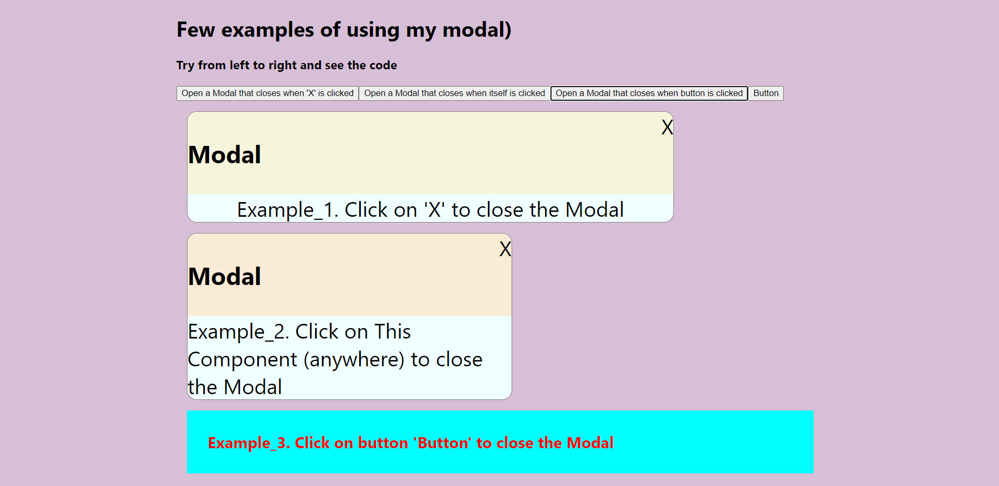

# This project is a simple modal window mechanism.

Project Features:

- No third party libraries
- Can wrap any component or markup
- Smooth appearance and disappearance
- When it disappears, it is removed from the DOM

How to use:

1. Pass the component or markup as prop "Component" in Modal component
2. In the description of the passed component, destructure the "onClose" prop
3. See examples for full understanding

## Available Scripts

In the project directory, you can run:

### `npm start`

Runs the app in the development mode.\
Open [http://localhost:3000](http://localhost:3000) to view it in your browser.

The page will reload when you make changes.\
You may also see any lint errors in the console.

### `npm run build`

Builds the app for production to the `build` folder.\
It correctly bundles React in production mode and optimizes the build for the best performance.

The build is minified and the filenames include the hashes.\
Your app is ready to be deployed!

See the section about [deployment](https://facebook.github.io/create-react-app/docs/deployment) for more information.

### Deployment

I don't think you want to deploy this)))
